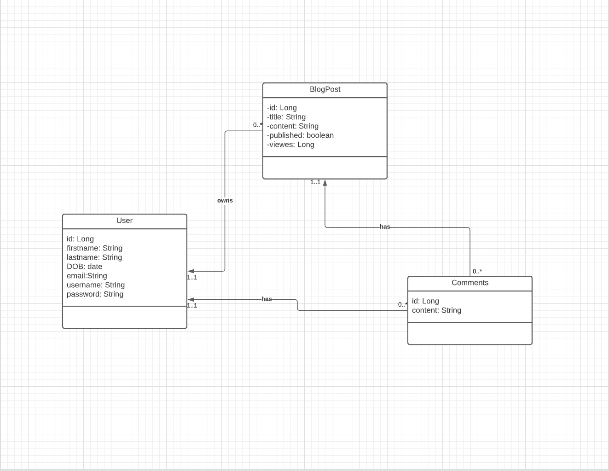

# Blog-it-REST API

Restful API for a Blogging Application

## Description

A Micro-service CRUD Restful API for a Blogging Application  

## Getting Started

### Dependencies

* Each Micro-service is a spring boot App
* Project structure is a maven multi module setup with a custom parent pom.xml at the root level.
* Requires JDK 1.8+, Maven 3.8
* spring boot dependencies version 2.6.3
* spring cloud dependencies 2021.0.0
* docker required to dockerize the application, there is a docker-compose file to spin up all the micro-services

### Sample class diagram 



### Executing the dockerized Application

* How to run the dockerized App using the docker-compose
* Clone the Repo - either using ssh or https
* Change directory to blog-it-REST - should be on the main branch
* create a .env file and add environment variables
* Do a maven clean
* Build images locally 
* Run docker-compose up
```
$ git clone git@github.com:sekayasin/blog-it-REST.git

$ cd blog-it-REST

$ blog-it-REST > vi .env

add these environment variables
-----------------------------
MYSQLDB_USER=root
MYSQLDB_ROOT_PASSWORD=123456
MYSQLDB_DATABASE=blog_db
-----------------------------

$ blog-it-REST > mvn clean 

$ blog-it-REST > mvn spring-boot:build-image -DSkipTests

$ blog-it-REST > docker-compose up

```

### Test the API 
A sample Post man collection will be shared here upon initial release of version v1. 


## Help

common problems or issues.
```
check if services are up and are discovered by the discovery server (eureka) 
via http://localhost:8761

Other issues might be caused by docker
check if containers are runnig

$ docker container ps -a
```

## Authors

Contributors names and contact info

1. Joshua - [@joshNic](https://github.com/joshNic)  
2. Dagmawi Moges - [@dagisky](https://github.com/dagisky)
3. Yasin - [@sekayasin](https://github.com/sekayasin)

